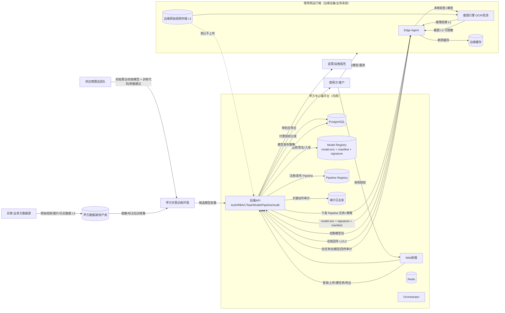
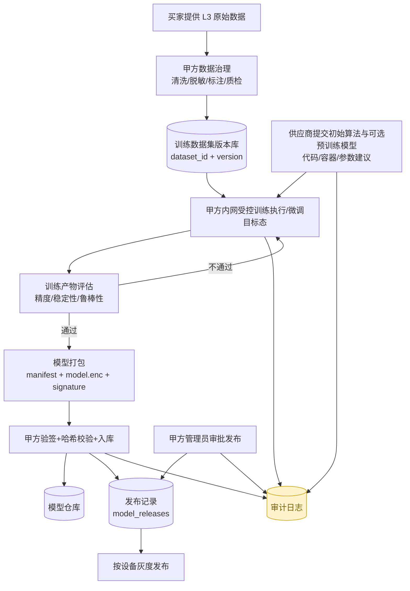
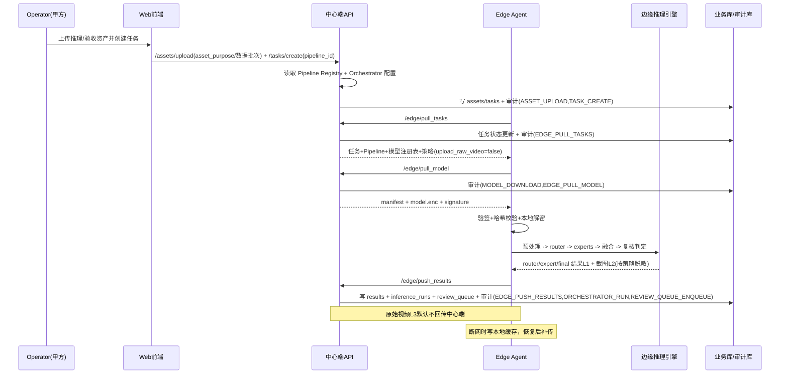
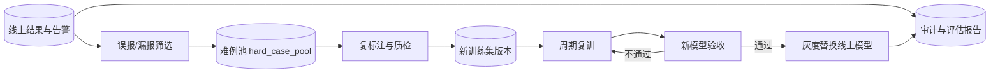

# 算法交易与托管训练平台 业务流程与数据流转图（成熟版）

> 目标：用统一视图说明“客户上传数据资产 + 供应商提供初始算法 + 平台受控微调审批 + Pipeline 编排交付运行”场景下的全流程数据流、控制流与审计流。

> 当前状态说明：本文中的训练链路已有最小控制面闭环落地。当前 MVP 已经支持训练作业对象、worker 注册、心跳、拉取作业、受控拉取训练资产/基线模型、候选模型回收入库和状态回传；但真正的训练执行、自动验证晋级与容量治理仍是后续阶段。

当前 MVP 在产品与接口层按 4 条业务线落地：

- 客户用户上传图片或视频资产，资产可用于训练、微调、测试验收或推理。
- 供应商上传初始算法与可选预训练模型，在平台受控环境内结合客户数据反复微调，形成候选成果模型并提交审批。
- 平台管理员结合客户测试数据验证模型有效性，审批并发布模型。
- 授权客户设备通过模型 API 或授权密钥使用加密模型，本地运行时完成解密。

## 1. 全局业务数据流（L0）

## 2. 训练与模型治理流（L1-Train）

> 注：本节描述的是“当前最小控制面 + 目标态执行面”的合并视图。当前仓库里已经支持训练/微调资产语义、模型提交审批发布、训练作业与 worker 闭环，以及候选模型回收入库；尚未支持真实训练执行。

## 3. 任务推理与结果回传流（L1-Infer）

> 注：这一节是当前已落地并可运行的真实链路。

## 4. 持续运营回流流（L1-Feedback）

## 5. 数据分级与控制点（用于评审）

| 数据级别 | 示例 | 默认流转策略 | 关键控制 |
|---|---|---|---|
| L1 低敏 | 推理JSON、bbox、统计指标 | 可回传中心端并落库 | API鉴权、结果审计、导出审计 |
| L2 中敏 | 抽帧截图/告警截图 | 按策略回传，可选脱敏 | 脱敏开关、访问控制、导出审批 |
| L3 高敏 | 原始视频 | 默认仅留边缘，不上传 | 审批开关、最小权限、强审计 |

## 6. 关键审计事件（必须覆盖）

- 用户侧：`LOGIN`、`ASSET_UPLOAD`、`MODEL_RECOMMEND`、`TASK_ROUTE`、`TASK_CREATE`、`RESULT_EXPORT`
- 模型侧：`MODEL_SUBMIT`、`MODEL_APPROVE`、`MODEL_REGISTER`、`MODEL_RELEASE`、`MODEL_DOWNLOAD`
- 流水线侧：`PIPELINE_REGISTER`、`PIPELINE_RELEASE`、`ORCHESTRATOR_RUN`、`REVIEW_QUEUE_ENQUEUE`
- 边缘侧：`EDGE_PULL_TASKS`、`EDGE_PULL_MODEL`、`EDGE_PUSH_RESULTS`

补充字段口径：

- 资产：`asset_purpose`、`dataset_label`、`use_case`、`intended_model_code`
- 模型提交：`model_source_type`、`model_type(router/expert)`、`runtime`、`plugin_name`、`inputs`、`outputs`
- 模型审批：`validation_asset_ids`、`validation_result`、`validation_summary`
- 模型发布：`delivery_mode`、`authorization_mode`、`api_access_key_preview`、`local_key_label`
- 流水线：`router_model_id`、`expert_map`、`thresholds`、`fusion_rules`、`threshold_version`
- 运行记录：`pipeline_version`、`models_versions`、`input_hash`、`result_summary`、`audit_hash`

## 7. 解释口径（对外统一）

- 压测：指边缘负载压力测试（并发/长稳/断网恢复），不是漏洞扫描。
- 难例池：线上误报漏报样本沉淀池，用于复训和回归。
- 主权边界：代码、数据、模型、密钥、发布权均在甲方；乙方提供算法能力但不掌控成果。
- 第 2 条业务线的默认前提：供应商可以参与调参与迭代，但客户数据与最终成果模型始终留在平台受控环境内。
- 当前实现提醒：平台已具备训练控制面最小闭环，但仍不应对外表述为“已具备完整分布式训练平台”。
- 商业边界：模型授权与收费由甲方统一执行；乙方仅提供技术支持，不直接向使用方分发或收费。
