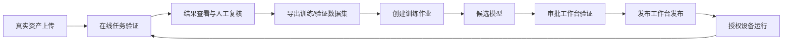
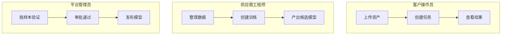
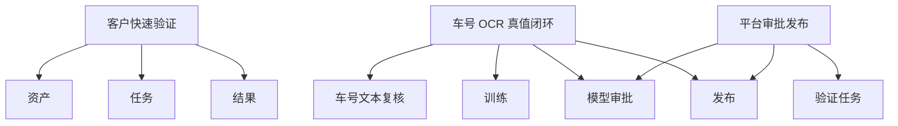

# 平台接入与功能使用指南

- Owner: Product / Platform
- Status: Active
- Last Updated: 2026-03-10
- Scope: Vistral 控制台接入、角色上手、核心功能使用、推荐操作路径
- Non-goals: 不覆盖底层源码级实现细节；不替代单接口 API 参考

## 1. 文档目的

本文档用于回答两个最核心的问题：

1. 新客户、供应商或平台管理员如何接入 Vistral。
2. 进入平台后，如何按照正确顺序使用资产、训练、模型、任务、结果、发布等功能。

本文档面向商业交付场景，强调：

- 真实可执行，不把目标态写成已上线能力。
- 减少试错，优先推荐最短可交付路径。
- 统一业务、交付、验证、发布和审计口径。

## 1.1 一图看懂平台闭环

一句话理解：

- 先用真实资产验证现有模型能不能跑通，再把结果沉淀成数据、训练出候选模型，最后审批发布给设备使用。

## 1.2 三类人最短路径

## 2. 平台定位

Vistral 是面向行业场景的小模型管理、训练微调、审批发布、边缘授权与结果审计平台。

平台当前已具备的核心闭环包括：

- 客户上传资产并创建推理任务。
- 供应商提交模型、基于数据集创建训练作业并产出候选模型。
- 平台管理员对候选模型做验证、审批、发布。
- 授权设备拉取已发布模型，在边缘环境执行推理并回传结果。
- 对推理结果做复核，再回灌为训练/验证数据集版本。

## 3. 角色与职责

### 3.1 客户操作员

主要职责：

- 上传现场图片 / 视频资产。
- 创建任务做在线识别验证。
- 查看结果并做业务验收。
- 对车号 OCR 等结果进行人工复核。

推荐入口：

- 资产
- 任务
- 结果

### 3.2 供应商工程师

主要职责：

- 上传基础模型或候选模型。
- 组织训练 / 微调数据。
- 创建训练作业并跟踪 worker 执行状态。
- 产出候选模型并提交平台审批。

推荐入口：

- 模型
- 训练
- 流水线

### 3.3 平台管理员 / 审批人员

主要职责：

- 审核模型 readiness 和验证结果。
- 批量挑选样本验证模型能力。
- 审批通过或驳回模型。
- 配置发布对象、设备范围、买家范围与交付方式。

推荐入口：

- 模型
- 任务
- 结果
- 审计

### 3.4 设备 / 边缘运维

主要职责：

- 核对设备在线状态与授权状态。
- 确认模型拉取、解密、推理执行是否正常。
- 跟踪边缘环境异常与审计记录。

推荐入口：

- 设备
- 审计

## 4. 平台接入五步法

可先记住这个顺序：

`账号与角色 -> 真实资产 -> 在线验证 -> 数据回灌 -> 训练审批发布`

### 第一步：准备账号、租户、角色

进入平台前，先明确：

- 属于客户、供应商还是平台侧。
- 使用哪个租户。
- 需要哪些权限。

最低建议：

- 客户操作员：资产上传、任务创建、结果查看
- 供应商工程师：模型查看、训练作业查看 / 创建
- 平台管理员：模型审批、发布、审计查看

### 第二步：准备资产与样本

建议先按用途整理资产：

- `training`：用于训练 / 微调
- `validation`：用于模型验证
- `inference`：用于在线推理

建议提前整理的信息：

- 资产来源
- 场景标签
- 是否涉及敏感信息
- 预期识别目标

### 第三步：明确模型目标

不要直接开始训练，先明确：

- 这是检测任务还是 OCR 文本任务
- 目标标签是什么
- 结果验收标准是什么

例如车号识别，当前默认合法规则是：

- 8 位数字

### 第四步：跑通小闭环

建议先跑最小闭环验证平台状态：

1. 上传 1 张真实图片
2. 在任务页选择明确目标
3. 选择一版模型
4. 创建任务
5. 等待结果完成
6. 在结果页核对输出

### 第五步：再进入训练与发布

只有在线验证链路正常后，再进行：

- 结果复核
- 数据集回灌
- 训练微调
- 审批发布

## 5. 推荐使用路径

## 5.0 路径总览图

## 5.1 客户快速验证路径

适用场景：

- 先看平台能不能识别
- 快速拿一张图验证现有模型

推荐步骤：

1. 进入资产页上传图片
2. 进入任务页
3. 明确输入目标，例如“车号”
4. 直接选可用模型
5. 点击开始快速识别
6. 在结果页查看文本、框、置信度与截图

## 5.2 车号 OCR 真值闭环

适用场景：

- 车号 OCR 精度提升
- 结果回灌训练集

推荐步骤：

1. 进入训练 > 车号文本复核
2. 逐条确认 `ocr_suggestion` 和 `final_text`
3. 导出训练资产并创建训练作业
4. 等待本机或指定 worker 跑完训练
5. 产出候选模型
6. 在模型中心审批工作台挑样本验证
7. 审批通过后进入发布工作台

## 5.3 平台审批发布路径

适用场景：

- 新模型上线
- 版本替换

推荐步骤：

1. 在模型页打开审批工作台
2. 查看 readiness、能力摘要和建议验证样本
3. 批量创建验证任务
4. 在结果页确认输出是否达标
5. 回到模型页审批通过
6. 打开发布工作台配置设备、买家和交付方式
7. 完成发布

## 6. 各功能模块说明

## 6.0 功能地图速览

| 模块 | 你来这里是为了什么 | 做完后下一步去哪里 |
|---|---|---|
| 工作台 | 看全局状态 | 资产 / 任务 / 模型 |
| 资产 | 上传真实图片、视频、数据集 | 任务 / 训练 |
| 训练 | 创建训练作业、看 worker | 模型 |
| 模型 | 审批候选模型、发布已通过模型 | 任务 / 设备 |
| 任务 | 创建在线推理任务 | 结果 |
| 结果 | 看识别输出、复核、回灌训练 | 训练 / 模型 |
| 设备 | 看授权和运行状态 | 审计 |
| 审计 | 回溯关键操作 | 模型 / 任务 / 设备 |

## 6.1 工作台

用途：

- 看全局状态，不做复杂编辑。

适合查看：

- 真实资产量
- 模型状态
- 成功任务量
- 设备在线状态

建议：

- 工作台只看“当前状态”，不要在这里做具体操作决策。

## 6.2 资产

用途：

- 上传、筛选、预览原始图片 / 视频资产。

推荐做法：

- 上传时就写清用途和来源。
- 推理验证用图片，训练用 ZIP / 数据集包。
- 避免把临时测试文件长期留在正式资产里。

## 6.3 模型

用途：

- 查看模型版本、来源、状态、审批与发布信息。

当前推荐操作：

- 先看审批工作台，再看发布工作台。
- 不建议绕过工作台直接做审批 / 发布动作。

## 6.4 训练

用途：

- 创建训练作业、查看 worker、跟踪训练产物。

推荐做法：

- 先确认 worker 处于 `ACTIVE`
- 使用预设创建训练作业
- 训练成功后直接去验证候选模型

如果是车号 OCR：

- 先在“车号文本复核”补真值，再创建训练作业

## 6.5 流水线

用途：

- 管理多模型协同执行逻辑

适合场景：

- 主模型做意图判断
- 再路由到不同专家模型

如果只是单模型验证，不建议先上流水线。

## 6.6 任务

用途：

- 创建在线推理任务
- 选择资产、任务类型、模型、设备

推荐做法：

- 普通用户先用快速识别
- 确认具体版本时再用显式模型创建任务
- 低频控制项放进“高级控制”

## 6.7 结果

用途：

- 查看任务输出
- 做 OCR / 检测结果复核
- 导出结果数据集版本

推荐做法：

- 先看验证结论与识别文本
- 再看截图和详细 JSON
- 结果确认后再回灌训练

## 6.8 设备

用途：

- 查看设备在线状态、授权状态和运行能力

排查重点：

- 是否在线
- 是否有权限拉取模型
- 是否能成功执行任务

## 6.9 审计

用途：

- 查谁在什么时候做了什么

适合回溯：

- 模型审批
- 训练作业状态变化
- 任务创建与结果导出
- 设备拉模型与执行

## 6.10 设置

用途：

- 核对当前用户、租户和权限

适合用于：

- 排查“为什么我看不到某个功能”
- 核对当前登录身份是否正确

## 7. 建议的商业交付节奏

建议按以下顺序推进交付：

1. 接通账号、租户、权限
2. 上传一批真实资产
3. 用现有模型完成一轮在线验证
4. 补关键结果真值
5. 启动一轮小规模训练 / 微调
6. 对候选模型做审批验证
7. 完成受控发布
8. 回收现场反馈，进入下一轮迭代

## 8. 常见误区

### 误区 1：一上来就训练

正确做法：

- 先验证现有链路能否稳定跑通，再进入训练。

### 误区 2：训练 ZIP 直接拿去做在线验证

正确做法：

- 在线验证应使用单图 / 视频资产。

### 误区 3：结果出来就默认可信

正确做法：

- OCR 尤其要结合合法规则、置信度和人工复核判断。

### 误区 4：审批和发布混在一起

正确做法：

- 先审批模型能力，再决定发布对象和交付方式。

## 9. 成功标准

如果平台接入和使用是健康的，应该至少能做到：

- 用户知道自己应该进入哪个模块
- 核心任务能在 3-5 步内完成
- 训练、验证、审批、发布闭环能被清晰理解
- 长文本、长 ID、批量结果不会把页面搞乱
- 出错时，系统能告诉用户下一步怎么做

## 10. 关联文档

- [README.md](../README.md)
- [demo.md](./demo.md)
- [company_responsibilities.md](./company_responsibilities.md)
- [training_control_plane.md](./training_control_plane.md)
- [product/current_execution_backlog_2026-03-10.md](./product/current_execution_backlog_2026-03-10.md)
